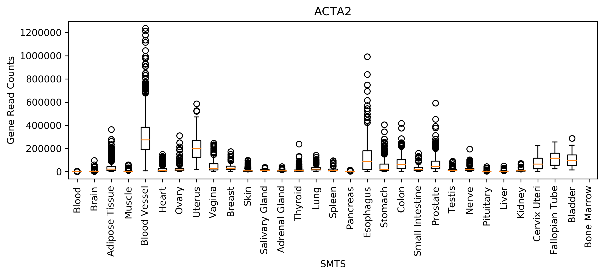

# parallel-arrays-profiling-and-benchmarking

[](https://travis-ci.com/cu-swe4s-fall-2019/parallel-arrays-profiling-and-benchmarking-tlfobe)

Parallel Arrays, Profiling, and Benchmarking

This is a repository where we will Benchmark datavisualization software based on the search method used to query arrays.

## Installation
This package depends on matplotlib and numpy, so please install those first before trying to run anything:

```
conda install matplotlib --yes
conda install numpy --yes
```

## Usage

There are two scripts with different implementations `plot_gtex.py` is the parallel array implementation of the data visualization and `plot_gtex_hash_tables.py` is the hash table implementation of the data visualization.

Both can be run as follows:

```
python plot_gtex.py --gene_reads GTEx_Analysis_2017-06-05_v8_RNASeQCv1.1.9_gene_reads.acmg_59.gct.gz --sample_attributes GTEx_Analysis_v8_Annotations_SampleAttributesDS.txt --gene ACTA2 --group_type SMTS --output_file ACTA2.png
```
This program requires a `gene_reads` for where the biological data is stored, `sample_attributes` lists all the genes possible, `gene` is the specific gene you'd like to visualize, `output_file` is the file you will output your visualization to.

This input will visualize the following graph.



## Benchmarking

This repository is meant to show some of the computational accelerations that can be achieved by using different search and add algorithms. Using the `--benchmark` flag we are able to get a time to generate the list of lists that contains the gene counts for each group from a selected attribute list.

To demonstrate this below, we will benchmark the two codes on the same inputs:

First the parallel arrays implementation:

```
$ python plot_gtex.py --gene_reads GTEx_Analysis_2017-06-05_v8_RNASeQCv1.1.9_gene_reads.acmg_59.gct.gz --sample_attributes GTEx_Analysis_v8_Annotations_SampleAttributesDS.txt --gene ACTA2 --group_type SMTS --output_file ACTA2.png --benchmark True
DONE! Time = 14.62671446800232
IMAGE PRINTED! Time = 1.0898737907409668
COMPLETE!
```

Then the hash table implemation:

```
$ python plot_gtex_hash_tables.py --gene_reads GTEx_Analysis_2017-06-05_v8_RNASeQCv1.1.9_gene_reads.acmg_59.gct.gz --sample_attributes GTEx_Analysis_v8_Annotations_SampleAttributesDS.txt --gene ACTA2 --group_type SMTS --output_file ACTA2.png --benchmark True
DONE! Time = 6.756650686264038
IMAGE PRINTED! Time = 1.117724895477295
COMPLETE!
```

From these benchmarking experiments we see that the hash table implementation almost halves the speed it takes of the parallel array implementation. This is due to the fast look up times of the has table we implemented.